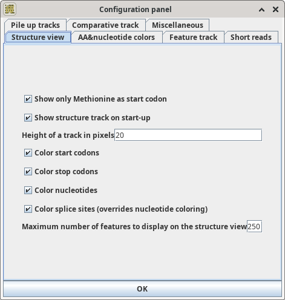

# Configuration

The [behaviour of GenomeView](Visualization.md) can be configured in the Configuration panel.
The configure panel is accessed through the menu File/Configuration.

The configuration panel has several tabs, discussed in the next sections.

The panel allows a subset of the configuration file values
to be changed. The documentation of the values currently is only in the
[example configuration](https://github.com/GenomeView/genomeview/blob/master/src/main/resources/conf/default.conf) file.

## Structure View
In this view you can enable or disable the way the viewer renders the genomes.

* Show only Methionine as start codon
* Show structure track on start-up
* Height of track in pixels
* Color start codons
* Color stop codons
* Color nucleotides
* Color splice sites (overrides nucleotide coloring)
* Maximum number of features to display

## AA & nucleotide colors
In this tab you can adjust the colors of the various nucleotides.
The default is that a is red, t green, g blue, c yellow, n black. 

## Feature Track

* Force labels on features
* Colors of feature types: 
   * color for NORMAL
   * color for  UTILITY 
   * color for POPUP

## Short Reads

* height of coverage graph. what is this, number of lines available in the plot?
* Heigth SNP track. Is a "SNP track" a short read?
* Minimum coverage for SNPs to be shown. 
* Maximum number of displayed reads. What does this mean? 25000 reads sounds very small, given human dna is done with 30x coverage or more? What if there are more reads?
* Max display depth of stacked reads
* Draw connection between paired reads. 
* max number of reads to cache. 
* max distance between paired reads. (Why is this value twice?)
* Color reads mapping to the forward strand for sense transcripts
* Color reads mapping to the reverse strand for sense transcripts
* Color reads mapping to the forward strand for anti-sense transcripts
* Color reads mapping to the reverse strand for anti-sense transcripts
* Color of line between paired reads
* Mate different chromosome
* Missing mate
* Splicing color

## File Up Tracks

* cross connect the track scaling
* Should all tracks use dynamic range?
* Should all tracks be log scaled
* Max height of pileup track
* switch from bar chart to line graph at ...

## Comparative track
* Enable comparative annotations
* Annotation type for comparative annotations: (text field! What are the options? Should be combobox?)
* Max visible range of comparative annotation: N
* Display extended names

# Miscellaneous
* Max zoom-out size
* Enable dual-screen mode
* Allow only one instance of GenomeView
* Enable genetic code selection
* Resolution increase factor
* select preferred language
* disable url caching
* reset configuration
* empty cache
