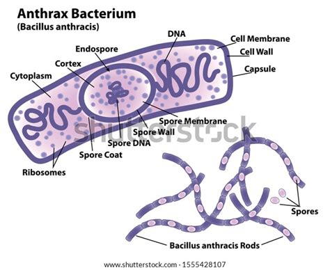
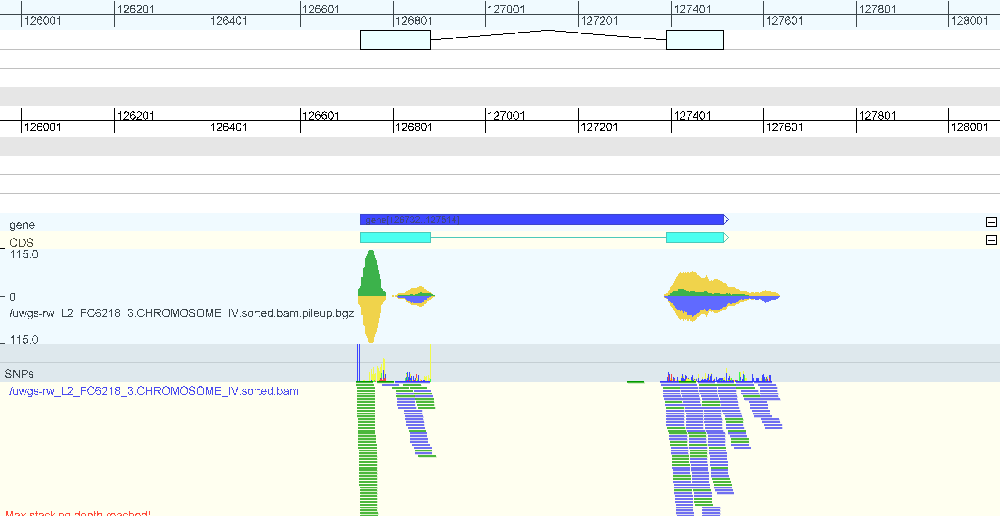

# Demo Data

This page presents a number of prepared, small size genome data sets.

For some datasets there are also multiple formats and alignments available.
We have prepared B.anthracis, C.elegans and D.melanogaster for you.

## B. anthracis
Bacillus anthracis is a bacterium that causes anthrax, a deadly disease to livestock and, occasionally, to humans.

<figure>
	
	<figcaption>Bacillus Anthracis (anthrax)</figcaption>
<figure>

  Download [B. anthracis basic dataset](https://software.broadinstitute.org/genomeview/demo/b_anthracis/). This dataset includes the references sequence for Bacillus anthracis, as well as annotion of genes, rRNAs and tRNAs. Two sequencing data sets are included. One whole genome sequencing to discover variations and one RNA-seq data set*.
  
There are also two multiple alignments available. Both contain the same set of aligned species, but differ in format: 
  
* [multi-fasta format](https://software.broadinstitute.org/genomeview/demo/b_anthracis/download/anthracis.mfa.gz) 
* [MAF format](https://software.broadinstitute.org/genomeview/demo/b_anthracis/download/anthracis.maf.gz) 

The visualizations for both formats are slightly different. You can either download the files and load them from disk, or you can copy the URL and open the URL directly in GenomeView.

 
##  C. elegans
Download [C. elegans](https://software.broadinstitute.org/genomeview/demo/c_elegans/download/c_elegans.tar.gz). This basic data set includes the references sequence for C. elegans, as well as gene annotion. We also included an RNA-seq data set, both as individual reads and as a pileup track. 

<figure>
	
	<figcaption>C. elegans</figcaption>
<figure>

## D. melanogaster
