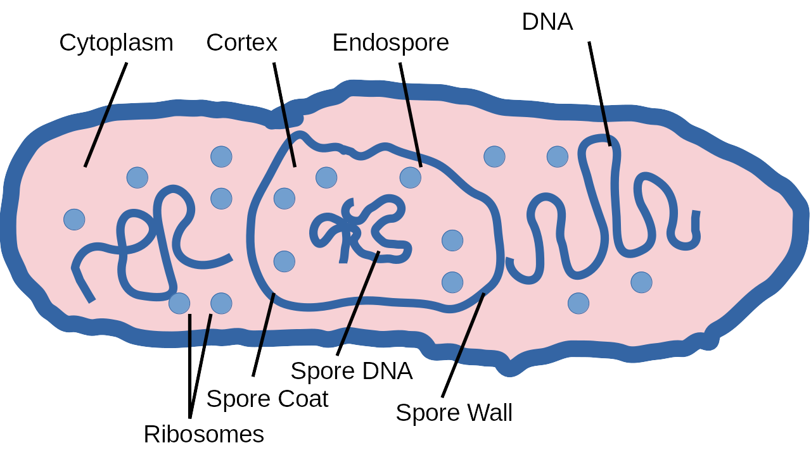
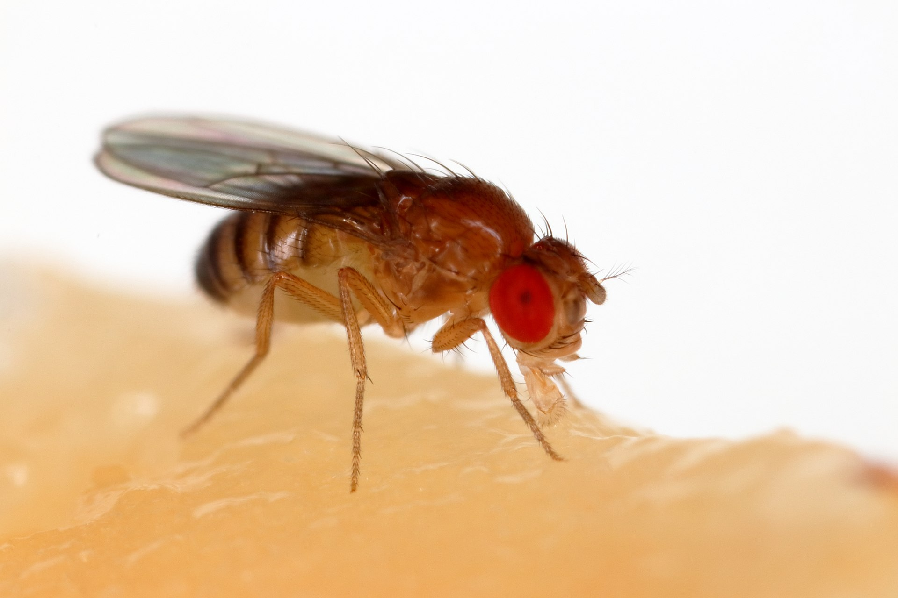
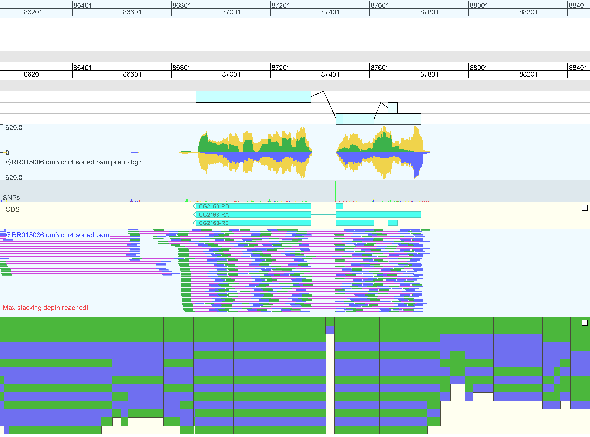

# Demo Data

This page presents a number of prepared, small size genome data sets.

For some datasets there are also multiple formats and alignments available.
We have prepared B.anthracis, C.elegans and D.melanogaster for you.

## B. anthracis
Bacillus anthracis is a bacterium that causes anthrax, a deadly disease to livestock and, occasionally, to humans.

<figure>
	
	<figcaption>Bacillus Anthracis (anthrax)</figcaption>
<figure>

  Download  or copy the link of  [B. anthracis basic dataset](https://software.broadinstitute.org/genomeview/demo/b_anthracis/). This dataset includes the references sequence for Bacillus anthracis, as well as annotion of genes, rRNAs and tRNAs. Two sequencing data sets are included. One whole genome sequencing to discover variations and one RNA-seq data set*.
  
There are also two multiple alignments available. Both contain the same set of aligned species, but differ in format: 
  
* [multi-fasta format](https://software.broadinstitute.org/genomeview/demo/b_anthracis/download/anthracis.mfa.gz) 
* [MAF format](https://software.broadinstitute.org/genomeview/demo/b_anthracis/download/anthracis.maf.gz) 

The visualizations for both formats are slightly different. You can either download the files and load them from disk, or you can copy the URL and open the URL directly in GenomeView.

 
##  C. elegans

Caenorhabditis elegans is a small worm of about 1 mm in length that lives in temperate soil environments

<table>
<tr>
<td>
<figure>
	
	<figcaption>C. elegans</figcaption>
<figure>
</td><td>
<figure>
	
	<figcaption>C. elegans</figcaption>
<figure>
</td>
</tr>
</table>

Download  or copy the link of  [C. elegans](https://software.broadinstitute.org/genomeview/demo/c_elegans/download/c_elegans.tar.gz). This basic data set includes the references sequence for C. elegans, as well as gene annotion. We also included an RNA-seq data set, both as individual reads and as a pileup track. 

## D. melanogaster
Drosophila melanogaster is often referred to as 'fruit fly'. 

<table>
<tr>
<td>
<figure>
	
	<figcaption>fruit fly</figcaption>
<figure>
</td><td>
<figure>
	
	<figcaption>Drosophila melanogaster gene</figcaption>
<figure>
</td>
</tr>
</table>

Download or copy the link of  [D. Melanogaster](https://software.broadinstitute.org/genomeview/demo/d_melanogaster/download/dmelan.tar.gz).

This basic data set includes the reference sequence for D. melanogaster, as well as gene annotation. A multiple alignment of twelve Drosophila species is included as a MAF file. Furthermore, transcriptome data in the form of paired-end RNA-seq is loaded. 
