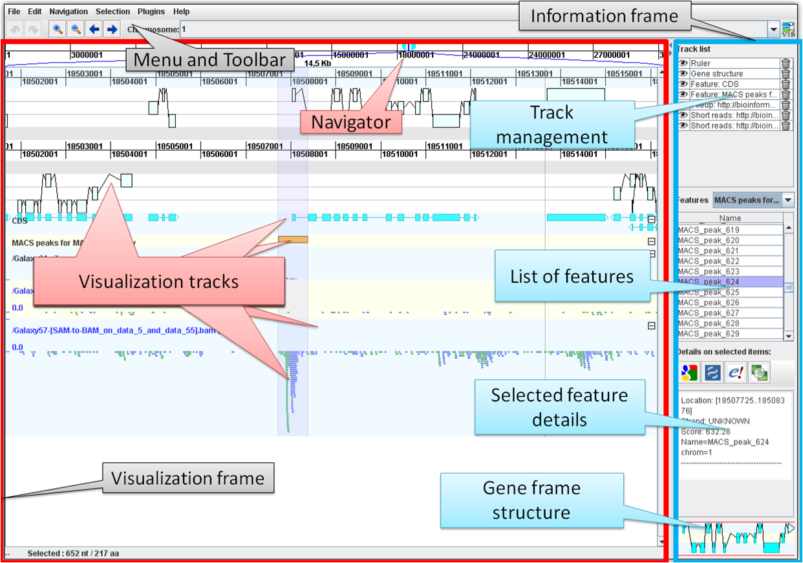

# GenomeView User Manual

Welcome to the GenomeView User manual. These pages aim to answer any questions you may have as an end-user.

## Introduction
To gain insignt into genomes, they are analysed
by various methods, and the analysis results need to be visualized
to get more insights.

GenomeViewer unifies the visualization step,
by integrating various analysis results into a unified visualization,
and by providing means to add annotations.

GenomeViewer can handle many of the existing analysis analysis formats,
and provides standard visualization tools for each of them.

Usually analysis is done with external tools. We provide
recommendations, links and instructions on how to use these tools.

## The User Interface

Below image shows the main user interface.

* On the top there are the various [menus](Menu.md). 
* Below that is a [toolbar](Toolbar.md)
* The main area on the left, bordered red in the image, are the [visualization tracks](Tracks.md)
* On the right you see various information: 
    * [track management](Tracks.md#Track-List) 
    * a [feature list](FeatureTrack.md#Feature-List) 
    * details of the selected features
    * a gene frame structure

# Interaction
You interact with the views using 
* the menus
* [keyboard shortcuts](KeyboardShortcuts.md)
* [mouse shortcuts](MouseShortcuts.md)

# The Visualization Tracks
Typically, a genome is viewed by viewing several data files related to this genome  simultaneously. 
Each data file has its own data format and it is displayed in its own track in a style fitting the format.
Therefore if you need a different visualization, you need to 
[create the proper data file](PrepareReadData.md)
first and then open it in the viewer.

# FAQ
Please check the [FAQ wiki](FAQ.md).
